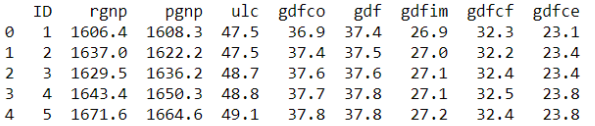

### **시계열**

### **목차**

### **단변량/일변량(univariate) vs 다변량(multivariate)**

---

1. 단변량(일변량이라고도 함) (multivariate)

   * 데이터는  예측을 위해 하나의 변수 만을 사용한다.

     

   * 외부 데이터 사용 불가능

   * 과거와 현재의 관계만을 바탕으로 예측

2. 다변량(multivariate)

   * 다변량 데이터는 예측을 위해 다수의 변수를 사용한다.

     

   * 외부 데이터 사용 가능

   * 과거와 현재, 변수 간의 관계를 바탕으로 예측

### **시계열 성분**

---

시계열에는 여러가지 성분들이 있습니다. 

#### **상황에 따른 모델 선택**

